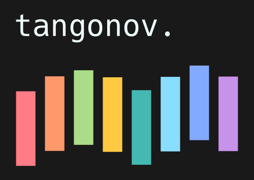

# Tangonov

**Note**: This is a mirror for https://sr.ht/~trevdev/tangonov-theme/

I encourage you to visit me on Sourcehut.

A pleasant dark theme with bright, easy to read pastels. I had originally made this theme as a contribution to Doom Themes as "doom-material-dark". This is the stand-alone verison of that theme.
